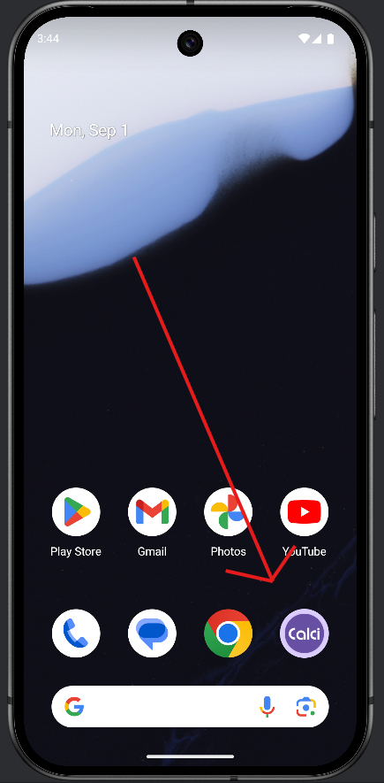
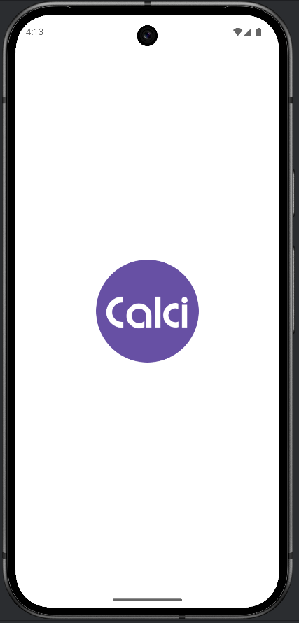
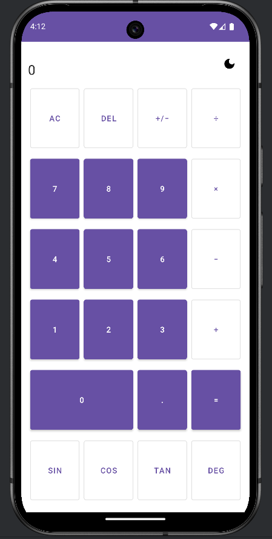
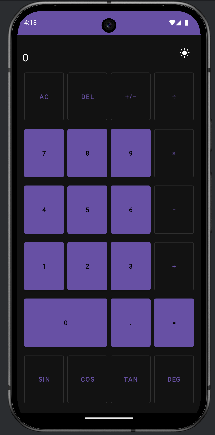

# Calculator | Android Challenge

A clean Android calculator with **Add / Subtract / Multiply / Divide / Sin / Cos / Tan**, a **Dark/Light mode toggle**, and **state that survives rotation & process death**.  
Core math lives in a separate **library module** (`calc-core`) so logic is testable and reusable.

---

## Executive Summary

- **Kotlin + Android SDK** with **Material** look & **ViewBinding**.
- **Architecture:** UI (app) ↔ **CalculatorEngine** (library), state held in **ViewModel**.
- **Resilience:** survives **rotation** (ViewModel) and **process death** (Parcelable snapshot/restore).
- **UX polish:** **Dark/Light mode** menu, landscape layout, divide-by-zero guard.
- **Tests:** JUnit tests for math & error paths.
- **Why a library?** Clean separation, unit-test friendly, drop-in for other apps.

---

## Features

- Basic ops: `+  −  ×  ÷`
- Trig: `sin  cos  tan` with **DEG/RAD** toggle  
- **Dark/Light mode** switch (persists across launches)  
- Shows **expression** and **result** distinctly  
- Optimized **portrait** & **landscape** layouts  
- **Division-by-zero** handled 

---

## Tech Stack & Key Skills

| Area | What I Used | Why It Matters |
|---|---|---|
| Language | **Kotlin (JDK 17)** | Modern, concise, null-safety |
| UI | **Material Components**, **ConstraintLayout**, **XML + ViewBinding** | Clean UI, safe view access, responsive layouts |
| State | **ViewModel (lifecycle-viewmodel-ktx)** | Survives rotation without leaks |
| Persistence (settings) | **SharedPreferences** | Small, fast toggle for Dark/Light |
| Module split | **`app`** + **`calc-core` (Android Library)** | Testable logic, reusable across apps |
| Serialization | **Parcelize (`org.jetbrains.kotlin.plugin.parcelize`)** | Snapshot engine state for process death |
| Testing | **JUnit 4** | Verifies core math & edge cases |
| Build | **AGP 8.5**, **Gradle**, **AndroidX** | Modern toolchain compatibility |

---

## Architecture Overview
DFCalculator/
├─ app/                        
│  ├─ MainActivity.kt           
│  ├─ MainViewModel.kt          
│  ├─ ThemePrefs.kt             
│  └─ res/                     
└─ calc-core/                  
   └─ CalculatorEngine.kt       

------------------------------------------

**Patterns used**
- *Separation of concerns:* UI vs. logic (library).
- *State holder:* ViewModel to retain engine across config changes.
- *Memento:* `EngineState` Parcelable for snapshot/restore after process death.
- *Command-ish:* Button clicks map to small engine actions (digit, op, equals).

---

## How to Run

1. Open the project in **Android Studio (Jellyfish or newer)**  
2. Use **JDK 17** (Gradle JVM)  
3. Press **Run** on the **`app`** module

> **SDKs**: `minSdk 24`, `targetSdk 34`, `compileSdk 34`

---

## Using the App

- Tap digits and operators; press `=` to compute.  
- **DEG/RAD** toggles trig angle mode.  
- Top-right menu toggles **Dark/Light** (persists).  
- Rotate: state is preserved (thanks to ViewModel).  
- If Android kills the app: state snapshots are restored on return.

---

## Screenshots

<p align="center">
  
  
</p>

<p align="center">
  
  
</p>

## Tests

Run unit tests (library module):

```bash
./gradlew :calc-core:test

