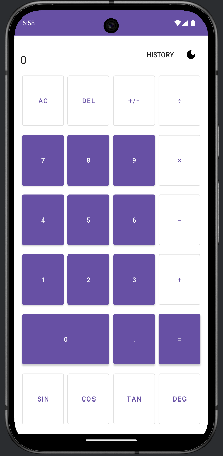
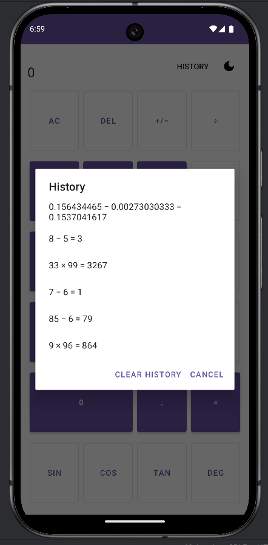

# Calculator — History Feature

This branch isolates the **History** feature of DFCalculator.  
It demonstrates how calculation results can be recorded and viewed from a persistent store, separate from the main calculator app.

---

## ✨ Feature Overview
- **History Button** in the toolbar
- **Persistent storage** using SharedPreferences (lightweight JSON)
- **Dialog UI** listing last 50 calculations (`expression = result`)
- Tap a history item → result is copied to clipboard
- Clear history option in the dialog
- Works alongside Dark/Light theme toggle

---

## Files in This Branch
Only the files relevant to this feature are kept here:
- `app/src/main/java/com/example/calculator/MainActivity.kt`  
- `app/src/main/java/com/example/calculator/history/HistoryStore.kt`  
- `app/src/main/res/menu/menu_main.xml`  
- `app/src/main/res/values/strings.xml`  
- `nf-screenshots.*` (example screenshot)

---

## Screenshots

<p align="center">
  
  
</p>
---

## How It Works
1. When you press `=`, the app captures the expression and result.
2. The pair is saved into a `SharedPreferences` file as JSON.
3. Pressing **History** in the toolbar opens a dialog:
   - Shows past calculations (most recent first, max 50).
   - Tap an item → result copied to clipboard.
   - "Clear history" removes all entries.

---

## 🚀 Running the Feature
1. Clone this branch:
   ```bash
   git clone -b new-feature https://github.com/arulmickel/Calculator.git


